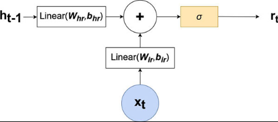
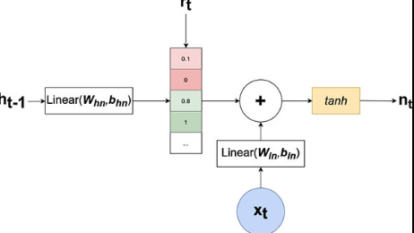
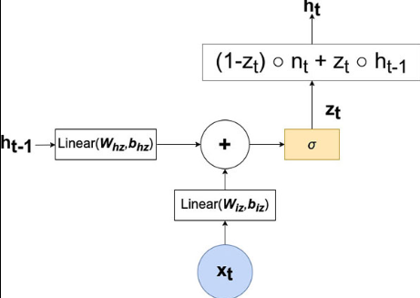

# Diagram

<figure markdown="span">
  { width="400" }
  <figcaption>Diagram for the $r_{t}$ component of the GRU</figcaption>
</figure>

<figure markdown="span">
  { width="400" }
  <figcaption>Diagram for the $n_{t}$ component of the GRU</figcaption>
</figure>

<figure markdown="span">
  { width="400" }
  <figcaption>Diagram for the $h_{t}$ and $z_{t}$ components of the GRU</figcaption>
</figure>

