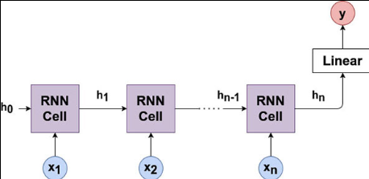
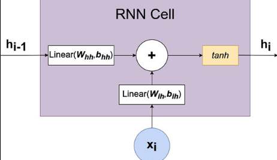

# Recurrent Neural Networks

## Diagram

<figure markdown="span">
  { width="400" }
  <figcaption>Diagram of a RNN</figcaption>
</figure>

- Input: $\textbf{x}_{t} \in \texttt{R}^{d}$  (channels of a sample, i.e. word of a sentence)
- Hidden state: $\textbf{h}_{t} \in \texttt{R}^{m}$, where $m$ is the number of hidden units
- Output: $\textbf{o} \in \texttt{R}^{q}$ (i.e. next word of the sentence)

where $t = 1, 2, ..., n$

## Cell definition

<figure markdown="span">
  { width="400" }
  <figcaption>Diagram of RNN cell</figcaption>
</figure>

$$
\textbf{h}_{t} = \sigma (\textbf{W}\textbf{h}_{t-1} + \textbf{U}\textbf{x}_{t} + \textbf{b})
$$

$$
\textbf{o}_{t} = \sigma (\textbf{V}\textbf{h}_{t} + \textbf{c})
$$

where, the trainable parameters are (the same for each time step $t$):

- $\textbf{U} \in \texttt{R}^{m \times d}$
- $\textbf{V} \in \texttt{R}^{q \times m}$
- $\textbf{W} \in \texttt{R}^{m \times m}$ 

