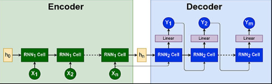
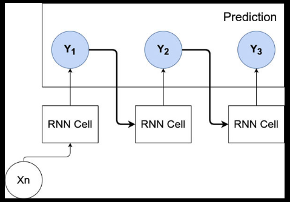
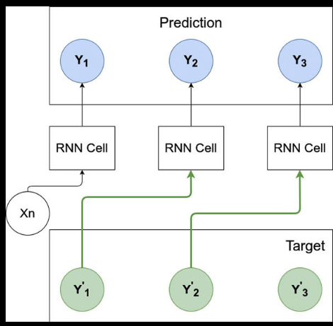
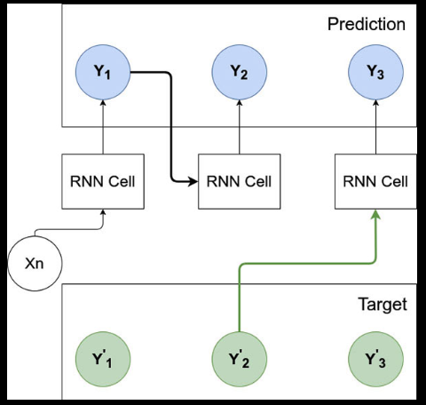

# Diagram

<figure markdown="span">
  { width="400" }
  <figcaption>Diagram Encoder-Decoder architecture</figcaption>
</figure>

<figure markdown="span">
  { width="400" }
  <figcaption>Recursive strategy for training</figcaption>
</figure>

<figure markdown="span">
  { width="400" }
  <figcaption>Teacher forcing strategy for training</figcaption>
</figure>

<figure markdown="span">
  { width="400" }
  <figcaption>Mixed strategy for training, with a parameter defining the ratio of decoder predictions and target values: 0 means recursive training, and 1 teacher forcing</figcaption>
</figure>
