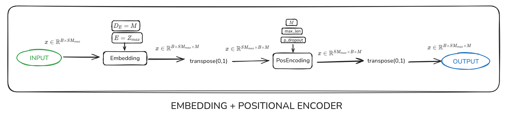
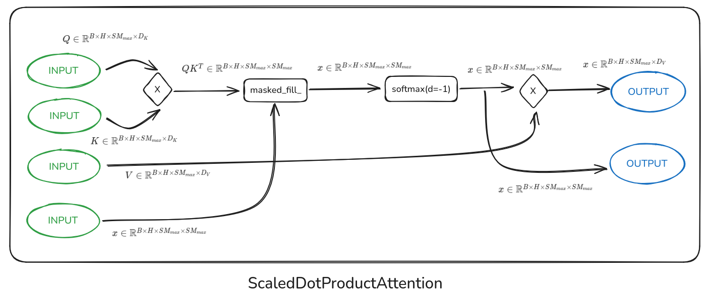
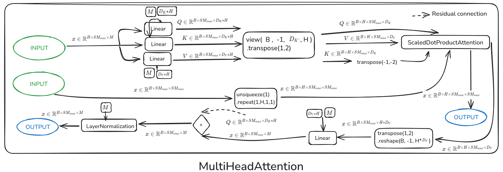
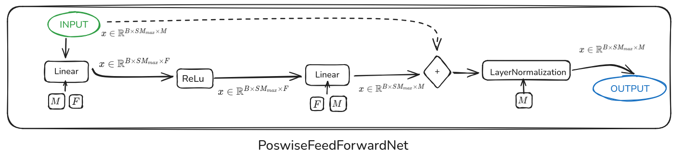
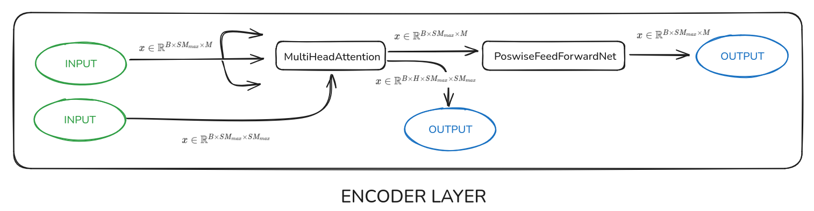
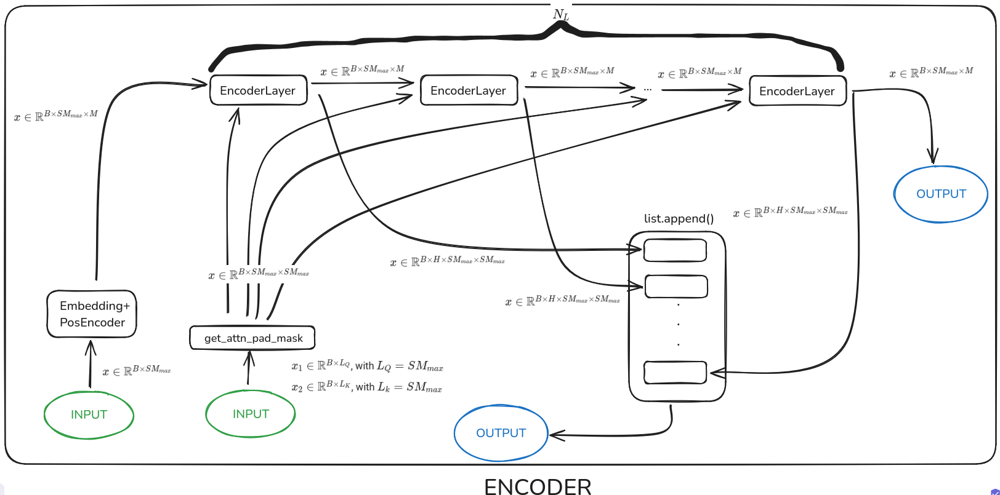

# Arquitecture of the Transformer

## Embedding + Positional Encoder

<figure markdown="span">
  { width="1050" }
  <figcaption>Embedding and Positional Encoder layers, before the Encoder layer</figcaption>
</figure>

## ScaledDotProductAttention

<figure markdown="span">
  { width="1050" }
  <figcaption>ScaledDotProductAttention</figcaption>
</figure>

## MultiHeadAttention

<figure markdown="span">
  { width="1050" }
  <figcaption>MultiHeadAttention</figcaption>
</figure>

# PoswiseFeedForwardNet

<figure markdown="span">
  { width="1050" }
  <figcaption>PoswiseFeedForwardNet</figcaption>
</figure>

## Encoder Layer

<figure markdown="span">
  { width="1050" }
  <figcaption>Encoder Layer</figcaption>
</figure>

## Encoder

<figure markdown="span">
  { width="1050" }
  <figcaption>Encoder</figcaption>
</figure>

